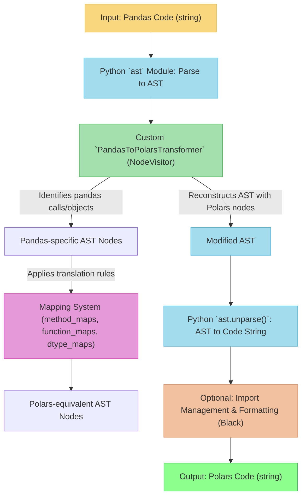

# Project Overview: Pandas-to-Polars Translator (pd2pl)

## 1. Mission

The primary goal of the `pd2pl` project is to **automate the translation of Python code using the pandas library into equivalent code using the Polars library.** This helps developers:

*   **Migrate existing pandas codebases** to Polars with significantly reduced manual effort.
*   **Learn Polars idioms** by seeing direct translations of familiar pandas operations.
*   **Improve performance** by leveraging Polars' modern, highly optimized, Rust-based backend.

## 2. How It Works: The AST Translation Pipeline

The translator operates by parsing Python code into an Abstract Syntax Tree (AST), transforming relevant pandas nodes within this tree, and then unparsing the modified AST back into Polars code.

**Key Stages:**

1.  **Parsing**: The input Python code (as a string) is parsed into an AST using Python's built-in `ast` module.
2.  **Transformation**: 
    *   A custom AST transformer (`PandasToPolarsTransformer`), which is a subclass of `ast.NodeTransformer`, traverses the AST.
    *   It identifies nodes representing pandas operations (e.g., `pd.DataFrame(...)`, `df.groupby(...)`, `df['col'].sum()`).
    *   For identified pandas operations, it consults a **Mapping System**.
3.  **Mapping System**:
    *   This system contains dictionaries and functions that define how specific pandas methods, functions, and dtypes translate to Polars equivalents.
    *   Examples: `mapping/method_maps.py`, `mapping/function_maps.py`, `mapping/dtype_maps.py`.
    *   It handles simple name changes (e.g., `df.sort_values()` to `df.sort()`) as well as more complex argument restructuring or chained operations.
4.  **AST Modification**: The transformer replaces the pandas AST nodes with new AST nodes that represent the corresponding Polars operations.
5.  **Unparsing**: The modified AST is converted back into a Python code string using `ast.unparse()`.
6.  **Post-processing (Optional)**:
    *   **Import Management**: Automatically adds or updates `import polars as pl` statements as needed.
    *   **Code Formatting**: Can format the output code using Black for consistency.

## 3. Project Components & Usage

The `pd2pl` translator is designed to be used in several ways:

1.  **Python Module (`pd2pl`)**: 
    *   The core translation logic resides in this package.
    *   You can import and use the `translate_code` function directly in your Python scripts.
    *   Example: `from pd2pl import translate_code; polars_code = translate_code("import pandas as pd; df = pd.DataFrame({'a': [1,2]})\ndf['a'].sum()")`

2.  **VS Code Extension (`vscode-pd2pl`)**: 
    *   Provides an integrated experience within the VS Code editor.
    *   Allows users to select pandas code and translate it in place or to a new panel.
    *   *(Note: The current status and implementation details of the VS Code extension would be found in its specific subdirectory.)*

3.  **API Service (Conceptual)**: 
    *   A potential future component could be a web API where users can submit pandas code and receive the Polars translation.
    *   *(Note: This is often a longer-term goal for such tools and may not be actively developed yet.)*

## 4. Key Technologies

*   **Python**: The primary language for the translator.
*   **`ast` module**: Python's built-in library for working with Abstract Syntax Trees.
*   **`astroid` (Optional but Recommended)**: A library that builds on `ast` to provide more advanced features like type inference and understanding of the full codebase context. It's particularly useful for resolving variable types and handling complex assignments or chained calls where the type of an object might not be immediately obvious from a single AST node.
*   **Polars**: The target library for translation.
*   **Pandas**: The source library being translated from.
*   **pytest**: For writing and running automated tests.
*   **Black**: For code formatting (both for the project's own code and optionally for the translated output).
*   **Mermaid.js**: Used in Markdown for rendering diagrams (like the one above).

## 5. Current Status & Roadmap

*   Refer to `../../TASKS.md` for a detailed list of implemented features, ongoing work, and planned enhancements.
*   The project is actively developed, focusing on expanding coverage of the pandas API and improving the quality of translations.

Next, proceed to the [Development Setup Guide](./DEVELOPMENT_SETUP.md) to get your environment ready. 