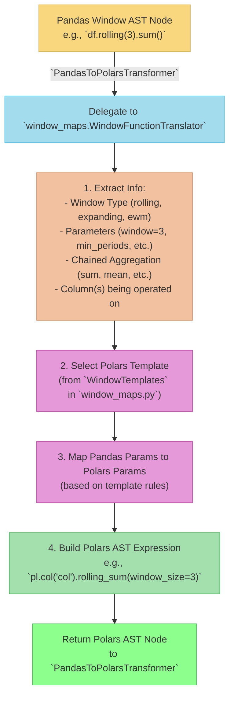

# pd2pl Guide: Translating Window Functions

This document details the architecture and approach for translating pandas window functions (e.g., `df.rolling(...)`, `df.expanding(...)`, `df.ewm(...)`) to their Polars equivalents within the `pd2pl` project. This is a complex area, so a dedicated guide is provided.

## 1. The Challenge with Window Functions

Pandas window functions offer a rich API with many parameters and chaining possibilities. A direct, one-to-one AST node replacement is often insufficient or would lead to overly complex and unmaintainable code in the main `PandasToPolarsTransformer`.

Key challenges include:
*   **Diverse Parameters**: `window`, `min_periods`, `center`, `win_type`, `on` (for time-based windows), `closed`, `alpha`, `com`, `span`, `halflife`, etc.
*   **Chained Aggregations**: Operations like `df.rolling(3).sum()`, `df.expanding().mean()`.
*   **Grouped Windows**: Operations like `df.groupby('group_col').rolling('time_col').agg(...)`.
*   **Idiomatic Polars**: Polars has its own powerful expressions for window operations, often involving `pl.col(...).rolling_sum(...)` or `pl.col(...).cumulative_sum().over('group_col')`. The translation should produce natural-looking Polars code.

## 2. Architectural Approach: Method Translation Registry with Templates

To address these challenges, `pd2pl` employs a more structured approach for window functions, centered around a **Method Translation Registry with Templates**, primarily managed within `pd2pl/mapping/window_maps.py`.

**Core Ideas:**

1.  **Specialized Handling**: Window function calls in the AST are identified by the `PandasToPolarsTransformer` (in `translator.py`) and delegated to a specialized handler or set of functions within `window_maps.py`.
2.  **Templates**: `window_maps.py` defines templates or patterns for common Polars window expressions.
    *   Each template captures the basic structure of a Polars window operation.
    *   They define how pandas parameters map to Polars parameters.
3.  **Expression Builder**: Logic within `window_maps.py` (or a helper class like `WindowFunctionTranslator`) acts as an expression builder.
    *   It selects the appropriate template based on the pandas window type (`rolling`, `expanding`, `ewm`) and the chained aggregation method (`sum`, `mean`, etc.).
    *   It populates the template with arguments extracted from the pandas AST call.
    *   It constructs the final Polars AST expression.



## 3. Key Components in `pd2pl/mapping/window_maps.py`

This module is central to window function translation.

*   **`WindowTemplates` (Conceptual or Actual Class)**:
    *   Contains static methods or a dictionary of templates for different window types.
    *   **Example `rolling_template`**: Might define that pandas `window` parameter maps to Polars `window_size`, `min_periods` to `min_periods`, etc., for a `rolling_X` function.
        ```python
        # Simplified Conceptual Template for rolling_sum
        # template = {
        #     'polars_base_method': 'rolling_sum',
        #     'params_map': {
        #         'window': 'window_size',        # pandas_param: polars_param
        #         'min_periods': 'min_periods',
        #         'center': 'center',
        #         # ... other params
        #     },
        #     'col_arg_required': True # Does it operate on pl.col("name")?
        # }
        ```
*   **`WindowFunctionTranslator` (Conceptual or Actual Class/Functions)**:
    *   **`translate(self, pandas_node, context)` method**: The main entry point called by `PandasToPolarsTransformer`.
    *   **`_extract_column_expr(self, ast_node)`**: Logic to correctly identify the column(s) the window operation is applied to. This can be complex if the window is applied to a Series resulting from a previous operation.
    *   **`_extract_params(self, pandas_ast_call_node)`**: Parses `args` and `keywords` from the pandas AST call node to get the window parameters.
    *   **`_build_expression(self, template, extracted_params, context)`**: Uses the chosen template and extracted parameters to construct the new Polars AST nodes. This involves creating `ast.Call`, `ast.Attribute`, `ast.Name`, and `ast.Constant` nodes for the Polars expression.

## 4. Handling Different Window Types

*   **`.rolling(...)`**:
    *   Typically translates to Polars `rolling_*` methods (e.g., `pl.col('x').rolling_sum(window_size=...)`).
    *   Parameters like `window` (for fixed windows), `on` (for time-based/dynamic windows using `group_by_dynamic`), `min_periods`, `center`, `closed` need careful mapping.
    *   The aggregation function (e.g., `.sum()`, `.mean()`, `.agg()`) chained after `.rolling()` determines the specific Polars method or how `agg()` is constructed.
*   **`.expanding(...)`**:
    *   Translates to Polars cumulative methods (e.g., `pl.col('x').cum_sum()`, `pl.col('x').cum_min()`).
    *   The mapping is `expanding().sum()` -> `cum_sum()`, `expanding().min()` -> `cum_min()`, etc.
    *   `min_periods` maps to Polars `min_periods` in some cumulative functions if available, or might require different handling.
*   **`.ewm(...)` (Exponentially Weighted Moving)**:
    *   Translates to Polars `ewm_*` methods (e.g., `pl.col('x').ewm_mean(alpha=...)` or `ewm_std`, `ewm_var`).
    *   Parameters like `com`, `span`, `halflife`, `alpha`, `min_periods`, `adjust` need to be mapped to their Polars equivalents (e.g., `alpha` for `ewm_mean`). Polars might prefer `alpha` directly, so `com`, `span`, `halflife` might need to be converted to `alpha`.

## 5. Chained Aggregations (e.g., `.sum()`, `.agg()`)

The method chained after the window specifier (e.g., `rolling(3).sum()`) is crucial:

*   **Simple Aggregations (`.sum()`, `.mean()`, etc.)**: The `WindowFunctionTranslator` will typically incorporate this into the main Polars method name (e.g., `rolling_sum`, `ewm_mean`).
*   **`.agg({...})` or `.apply(...)`**: These are more complex.
    *   If `.agg()` is used with a dictionary of aggregations on a rolling/expanding window, it might translate to multiple Polars expressions within a `select` or `with_columns` context.
    *   Custom `apply` functions are very hard to translate directly and might be marked as unsupported or require a Polars UDF equivalent (`.map_elements()`), which has performance implications.

## 6. GroupBy + Window Operations

When a window operation is applied after a `groupby` (e.g., `df.groupby('cat').rolling(3).sum()`):

*   The Polars translation often involves an `over()` clause: `pl.col('value_col').rolling_sum(window_size=3).over('cat')`.
*   The `WindowFunctionTranslator` needs to be aware of the `groupby` context to correctly construct the `over()` part of the expression.
*   This might involve passing context from the `_transform_groupby_agg` method in `translator.py` to the window translation logic.

## 7. Testing Window Functions

Thorough testing is critical for window functions due to their complexity.

*   Create tests in `tests/` (e.g., `test_window_translations.py` or integrated into existing method tests).
*   Test various combinations of parameters for each window type.
*   Test different chained aggregation methods.
*   Test with and without `groupby`.
*   Verify correct handling of edge cases like `min_periods`, `center`, different `closed` values for time windows.
*   Ensure the generated Polars code is not only correct but also idiomatic and performant where possible.

By following this structured, template-based approach, `pd2pl` aims to provide robust and maintainable translations for pandas window functions.

Return to the main [ONBOARDING.md](./ONBOARDING.md) or [Contribution Workflow](./CONTRIBUTION_WORKFLOW.md). 